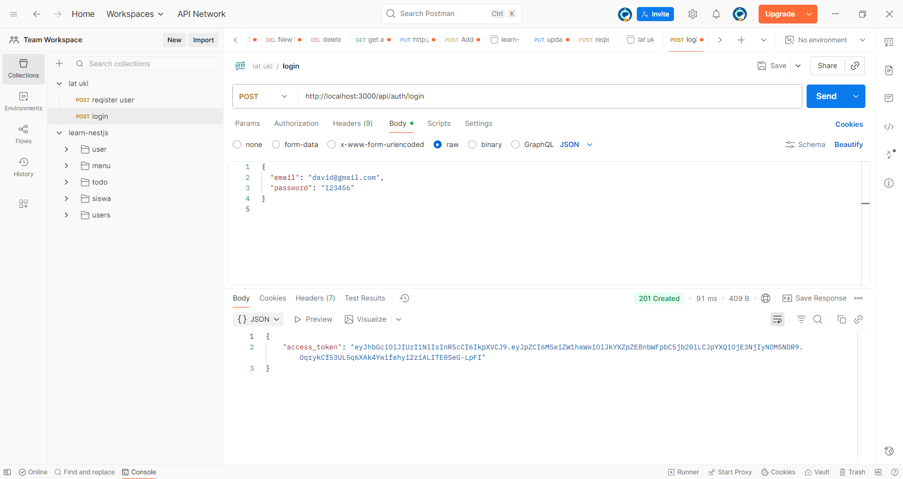
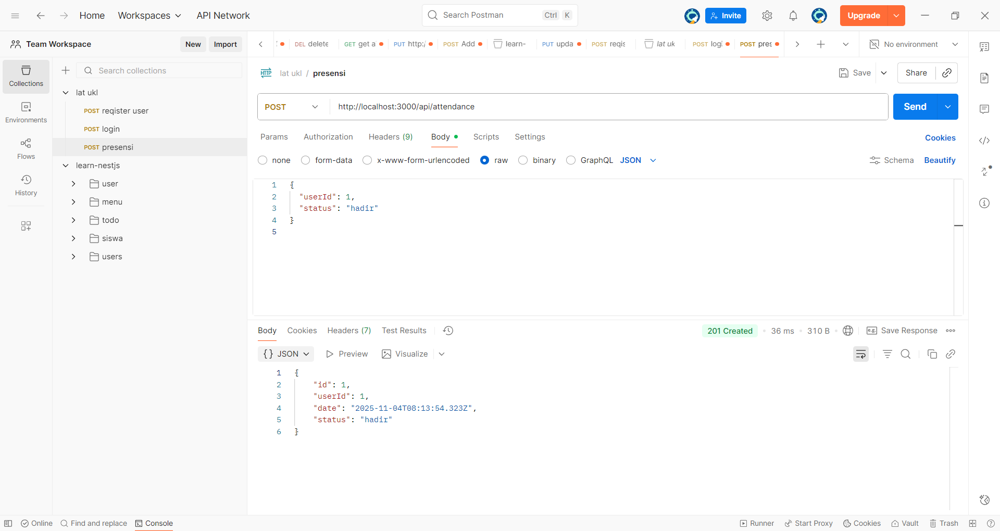
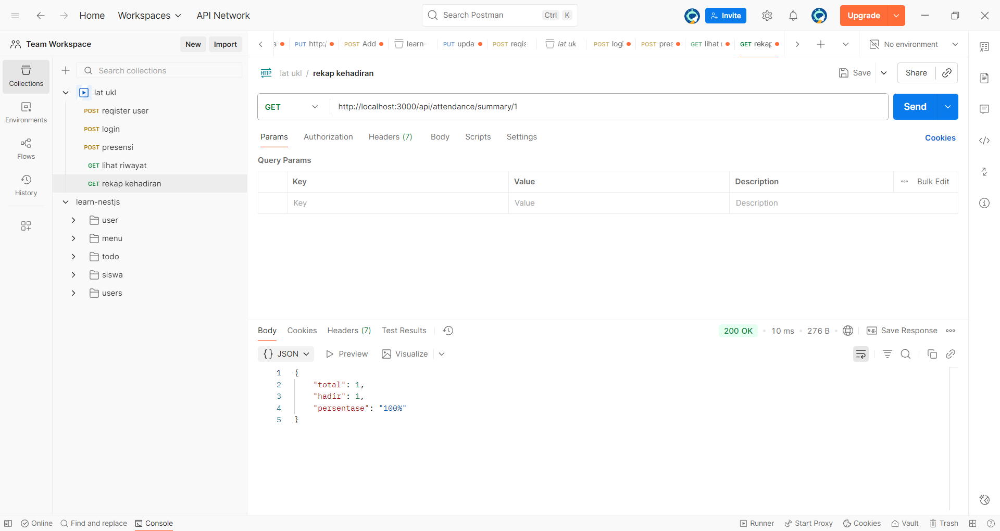

# 📘 Aplikasi Presensi Online (Backend)

## 🧩 Fungsi Program
Program ini berfungsi untuk mengelola **presensi (kehadiran)** siswa atau karyawan secara online melalui RESTful API.  
Fungsi utamanya meliputi:
- Menambahkan dan mengelola data pengguna (siswa/karyawan).  
- Login dengan autentikasi **JWT Token**.  
- Mencatat kehadiran pengguna (hadir, izin, alpha).  
- Melihat riwayat dan rekap kehadiran setiap pengguna.  

Seluruh data tersimpan di **database MySQL** menggunakan **ORM Prisma** dan diproses melalui **framework NestJS**.

---

## ⚙️ Cara Kerja Program
1. **User Registration** — Pengguna baru ditambahkan melalui endpoint `/api/users`.  
2. **Login** — Pengguna login di `/api/auth/login` untuk mendapatkan token autentikasi (JWT).  
3. **Presensi** — Pengguna melakukan absensi di `/api/attendance` dengan status hadir/izin/alfa.  
4. **Riwayat Presensi** — Data kehadiran dapat dilihat di `/api/attendance/history/{user_id}`.  
5. **Rekap Kehadiran** — Sistem menghitung total kehadiran dan persentase di `/api/attendance/summary/{user_id}`.  

Program diuji menggunakan **Postman**, dengan format request & response JSON.

---

## 📸 Hasil Output (Screenshot Postman)

| No | Endpoint | Method | Deskripsi | Screenshot |
|----|-----------|---------|------------|-------------|
| 1 | `/api/users` | POST | Menambah pengguna baru |  |
| 2 | `/api/auth/login` | POST | Login dan menghasilkan token JWT |  |
| 3 | `/api/attendance` | POST | Melakukan presensi pengguna |  |
| 4 | `/api/attendance/summary/1` | GET | Melihat rekap kehadiran bulanan |  |
| 5 | `/api/attendance/history/1` | GET | Melihat history kehadiran |  |

---

## 👨‍💻 Pembuat
**Nama:** David Filbert  
**Kelas:** XI RPL 1
**Framework:** NestJS + Prisma + MySQL
